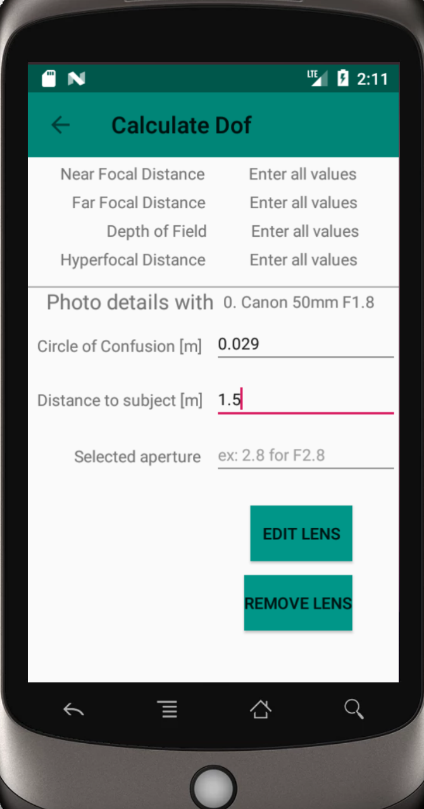

## Depth of Field Calculator

A simple Android application to help photographers estimate the focal point of the camera. 

By providing the information of:
- Camera
- Circule of confusion
- Distance to subject
- Aperture

The app calculates:
- Near focal distance
- Far focal distance
- Depth of Field
- Hyperfocal distance

## Screenshots

	

  		
  		
  		
	

